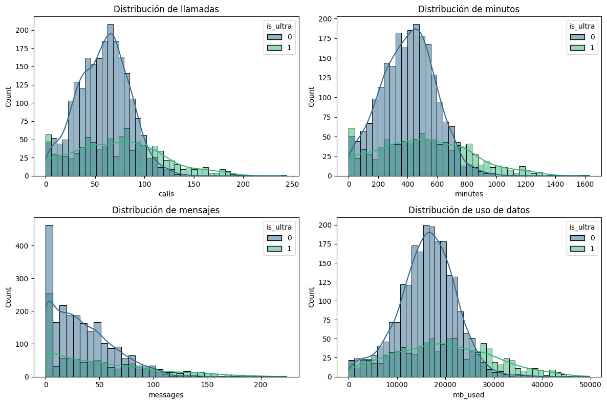

In response to Megaline's need to migrate customers from legacy plans to their new Smart and Ultra plans, this project aims to develop a classification model based on user behavior. By analyzing historical data, such as the number of calls, call duration, text messages, and internet usage, the model predicts the most suitable plan for each customer. The goal is to achieve a minimum accuracy of 75%, which will benefit Megaline by increasing the adoption of its new plans and improve the customer experience by offering personalized recommendations.

